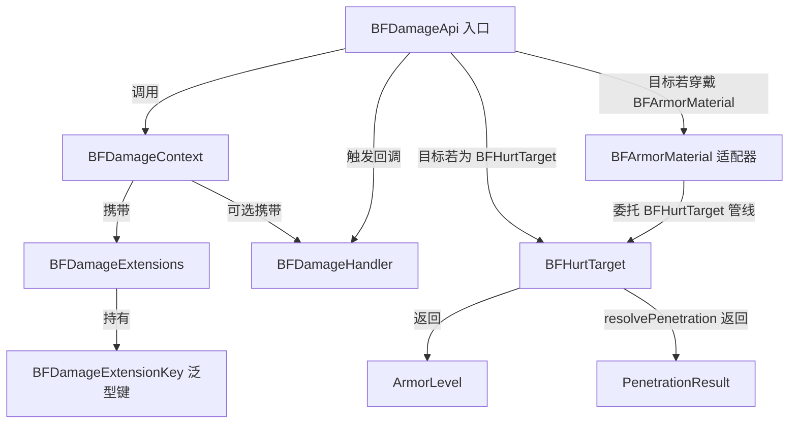

# 1.5 核心 API 速览

本章汇总了协议层全部公开 API 类及其职责。所有类均位于 `io.github.sweetzonzi.ballistics_framework.api` 包中——这是你在代码中唯一需要 import 的包。

## API 类全景

协议共有 11 个公开 API 类型：1 个静态入口、1 个数据 record、1 个 Builder、3 个接口、3 个枚举、1 个容器、1 个泛型键。按使用角色分类如下。

### 全部角色共用

| 类 | 类型 | 一句话职责 |
|---|------|----------|
| `BFDamageApi` | 静态工具类 | 协议唯一入口。`hurt()` 发起伤害，`hasContextFor()` 重入守卫，`getContextFor()` 获取当前上下文 |
| `BFDamageContext` | record | 一次命中的完整上下文——伤害来源、标称伤害、命中速度、命中点、命中面法线、穿深、扩展容器、handler |
| `BFDamageContextBuilder` | Builder | `BFDamageContext` 的构建器，通过 `BFDamageContext.builder()` 获取 |

### 武器侧主要使用

| 类 | 类型 | 一句话职责 |
|---|------|----------|
| `BFDamageHandler` | 接口 | 伤害发起方回调。提供 `onPenetrated` / `onBlocked` / `onRicochet` 三个主结果回调，以及由 `isOvermatch` / `isSpall` 判定触发的 `onOvermatch` / `onSpall` 派生回调。包含便捷方法 `dealDamage(target, ctx)` |
| `PenetrationResult` | 枚举 | 穿甲判定的一次性结果——`PENETRATED`（击穿）、`BLOCKED`（未击穿）、`RICOCHET`（跳弹），三者互斥 |
| `BFDamageExtensions` | 容器类 | 类型安全的扩展数据读写容器，兼有预定义 key 常量（`FUSE_DELAY`、`CALIBER`、`MASS`）。读操作总返回非 null |
| `BFDamageExtensionKey` | 泛型键 | 扩展字段的泛型 key，绑定 `ResourceLocation`、`Class<T>` 和默认值工厂。通过 `BFDamageExtensions.register()` 创建 |

### 护甲侧主要使用

| 类 | 类型 | 一句话职责 |
|---|------|----------|
| `BFHurtTarget` | 接口 | 协议伤害目标接口。声明实体自行处理穿甲判定。包含 5 个管线方法的默认实现，简单模组只需覆写 `getArmorLevel()` 和 `hurt()` |
| `BFArmorMaterial` | 接口 | 协议护甲物品接口。头盔/胸甲/护腿/靴子实现此接口后，穿戴者自动获得穿甲判定能力——无需 Mixin、事件或手动拦截 |
| `ArmorLevel` | 枚举 | 13 级离散穿甲/护甲等级（UNARMORED_1 ~ SUPER_HEAVY_6 + 元等级 UNPENETRABLE），提供 RHA 双向映射、等级判定和本地化显示名 |

## 各类型详解

### BFDamageApi

协议层的唯一对外入口，所有方法均为 `static`。外部 mod 永远不需要实例化此类。

- `hurt(Object target, BFDamageContext ctx)`：发起一次协议伤害。自动完成 ThreadLocal 栈的压入/弹出、穿甲管线调度、回调触发。返回实际造成的伤害量。如果目标是普通 `Entity`（未实现 `BFHurtTarget`），走原版 `entity.hurt()`。
- `hasContextFor(Object target)`：判断当前线程中是否已有针对指定目标的上下文。主要供 Mixin 注入点使用，做重入守卫。
- `getContextFor(Object target)`：获取当前线程中指定目标的命中上下文。在 `BFHurtTarget` 的管线方法（特别是 `hurt()`）内调用，以读取命中点、入射方向等信息。

### BFDamageContext

Java 16 record，构造后所有字段只读。包含 7 个字段和一个 `handler` 引用：

| 字段 | 类型 | 说明 |
|------|------|------|
| `source` | `DamageSource` | 原版伤害来源。携带 attacker、projectile、damage type 等信息 |
| `baseDamage` | `float` | 标称伤害量。护甲侧 `calculateFinalDamage` 基于此值计算 |
| `hitVelocity` | `Vec3` | 命中速度矢量（世界坐标，m/s）。需角度时自行 normalize |
| `hitPoint` | `Vec3` | 命中点世界坐标。用于部位判定和粒子/音效位置 |
| `hitNormal` | `Vec3` | 命中面法线，指向面外侧。用于入射角计算 |
| `penetration` | `float` | 理论穿深（垂直入射 RHA 等效厚度，mm） |
| `extensions` | `BFDamageExtensions` | 扩展数据容器 |
| `handler` | `@Nullable BFDamageHandler` | 伤害发起方回调接口 |

提供两个辅助方法：`getPenetrationLevel()` 将 penetration 映射为 `ArmorLevel`；`withHandler()` 返回一个替换了 handler 的新上下文实例；`childContext(newBaseDamage, newPenetration)` 构造子上下文，用于双层串联管线中护甲层向本体层传递修正后的弹头状态。

### BFHurtTarget

接口定义了 7 个方法，其中 5 个有默认实现。按管线调用顺序：

| 方法 | 默认行为 | 何时覆写 |
|------|---------|---------|
| `getArmorLevel(ctx)` | 抽象方法，必须实现 | 简单模组只需实现此方法 |
| `getRHA(ctx)` | 取 `getArmorLevel.medianRha()` | 需要精确 RHA 数值时 |
| `modifyPenetration(ctx)` | 直接返回 `ctx.penetration()` | 实现爆反拦截、间隙衰减等 |
| `resolvePenetration(ctx)` | 委托 `isArmorPenetrated`，仅区分 PENETRATED/BLOCKED | 需要跳弹判定时 |
| `calculateFinalDamage(ctx, result)` | 三级模型（0%/65%/100%） | 需要非零钝伤、超匹配加成时 |
| `hurt(source, amount)` | 抽象方法，必须实现 | 通常委托 `super.hurt()` |
| `createContextFromVanilla(source, amount)` | 抽象方法，必须实现 | 想让原版伤害走协议管线时构造上下文；否则返回 null |

### BFArmorMaterial

供护甲物品实现的接口。与 `BFHurtTarget` 功能对称，但操作粒度下沉到**装备槽位**——每个管线方法均以 `(EquipmentSlot slot, BFDamageContext ctx)` 为签名。穿戴了此护甲的实体自动获得穿甲判定能力，零事件订阅。

| 方法 | 默认行为 | 何时覆写 |
|------|---------|---------|
| `getArmorLevel(slot, ctx)` | default 返回 UNARMORED_1 | 简易模式只需覆写此方法，按槽位返回等级 |
| `getRHA(slot, ctx)` | 取 `getArmorLevel.medianRha()` | 需要精确 mm 级等效厚度 |
| `modifyPenetration(slot, ctx)` | 直接返回 `ctx.penetration()` | 爆反拦截（ERA）、间隙衰减等减效逻辑 |
| `resolvePenetration(slot, ctx)` | 委托 `isArmorPenetrated`，仅区分 PENETRATED/BLOCKED | 需要跳弹判定（入射角过大 → RICOCHET） |
| `calculateFinalDamage(slot, ctx, result)` | 三级模型（0%/65%/100%） | 钝伤、超匹配加成、按槽位区分伤害倍率 |
| `mapHitToSlot(wearer, ctx)` | 按命中点高度占比映射（头>85%/躯55%~85%/腿35%~55%/脚<35%） | 全覆盖头盔、盾牌、自定义部位映射 |

适配器的 `hurt` 委托 `entity.hurt()` 走原版管线——这意味着原版护甲属性（ARMOR / TOUGHNESS）和保护附魔会在协议伤害之上叠加，形成两层防护模型。当实体同时实现 `BFHurtTarget` 并穿戴 `BFArmorMaterial` 护甲时，协议按双层串联管线处理——护甲层先拦截，本体层再做残余判定。

### ArmorLevel

13 级离散等级，按防护强度升序排列。等级判定使用 `>=` 比较（等于算击穿）。

| 枚举常量 | RHA 区间 | 参考对象 |
|---------|----------|---------|
| `UNARMORED_1` | 0~1mm | 血肉、无保护表面 |
| `UNARMORED_2` | 1~3mm | 几丁质甲壳、木板 |
| `LIGHT_1` | 3~5mm | 轻型防弹衣、铁皮 |
| `LIGHT_2` | 5~10mm | 重型防弹衣 |
| `MEDIUM` | 10~20mm | 一般车辆车架 |
| `HEAVY` | 20~40mm | 步战车正面、坦克侧后 |
| `SUPER_HEAVY_1` | 40~80mm | 二战早期中型坦克 |
| `SUPER_HEAVY_2` | 80~150mm | 二战晚期重型坦克 |
| `SUPER_HEAVY_3` | 150~300mm | 冷战早期主战坦克 |
| `SUPER_HEAVY_4` | 300~600mm | 冷战中期+爆反 |
| `SUPER_HEAVY_5` | 600~1200mm | 冷战晚期现代 MBT |
| `SUPER_HEAVY_6` | 1200~2000mm | 最高常规防护等级 |
| `UNPENETRABLE` | 2000~∞ | 绝对不可击穿（元等级，仅显式引用） |

关键方法：`fromRha(float)` 将 RHA 值映射为枚举；`canDefeat(ArmorLevel)` 做等级间判定（对 `UNPENETRABLE` 永远返回 false）；`upperRha()` / `lowerRha()` / `medianRha()` 返回边界值；`getArmorDisplayName()` / `getPenetrationDisplayName()` 返回本地化显示名。

### BFDamageHandler

武器侧实现的回调接口，所有方法均有 `default` 空实现，按需覆写。回调在管线末尾、伤害执行之后、上下文栈出栈之前触发。

事件回调：`onPenetrated`、`onBlocked`、`onRicochet`、`onOvermatch`、`onSpall`。

判定方法：`isOvermatch`（默认：击穿且穿深 > 装甲厚度 × 1.5）、`isSpall`（默认：未击穿，或击穿但非超匹配）。协议只根据这两个方法的返回值决定是否触发 `onOvermatch` / `onSpall`，不会额外把它们绑定到固定结果分支。

便捷方法：`dealDamage(target, ctx)` 等价于 `BFDamageApi.hurt(target, ctx.withHandler(this))`。

### 扩展系统

`BFDamageExtensions` 是类型安全的 key-value 存储，每个 `BFDamageContext` 持有一个实例。`set(key, value)` 写入，`get(key)` 读取——未设置时退回注册的默认值。需要复用基础扩展数据时，可以使用 `copy()` 或 `new BFDamageExtensions(other)` 创建浅拷贝。

`BFDamageExtensionKey<T>` 通过 `BFDamageExtensions.register(id, type, defaultValueFactory)` 创建全局单例，建议存为 `public static final` 常量。

协议预定义了三个 key：
- `FUSE_DELAY`（Float, 默认 0）——引信延迟（秒）
- `CALIBER`（Float, 默认 0.1）——弹体口径（米）
- `MASS`（Float, 默认 10）——弹体质量（千克）

## 类间关系

以下示意了协议 API 类之间的核心关系。

武器侧开发者主要操作上半部分：通过 `BFDamageContext.builder()` 构造上下文，可选注入 `BFDamageHandler` 和写入扩展数据，然后调用 `BFDamageApi.hurt()`。

护甲侧开发者主要操作下半部分：如果目标是实体，让它实现 `BFHurtTarget`；如果目标是护甲物品，让它实现 `BFArmorMaterial`。两者均返回 `ArmorLevel` 或覆写管线方法，最终由 `resolvePenetration` 返回 `PenetrationResult`。

## 下一步

到这里你已经阅读了整个第一章，对协议的全貌有了基本的掌握。根据你的角色，可以选择不同的深入学习路径：

- **武器侧开发者**：进入[第二章 武器侧开发](../2-武器侧开发/2.1-构造命中上下文.md)，深入了解上下文的每个字段、命中几何信息的计算、回调的完整用法和扩展注册的最佳实践。
- **护甲侧开发者**：进入[第三章 护甲侧开发](../3-护甲侧开发/3.1-实现BFHurtTarget.md)，深入了解 `ArmorLevel` 体系、每个管线方法的覆写策略、斜穿修正的默认实现和最终伤害计算的定制。如果是护甲物品开发者，直接看 [3.6 BFArmorMaterial 接口](../3-护甲侧开发/3.6-BFArmorMaterial接口.md)。
- **想理解协议内幕**：进入[第四章 协议内幕](../4-协议内幕/4.1-穿甲判定管线.md)，了解管线的完整调用链、扩展机制的设计原理以及 ThreadLocal 上下文栈的工作方式。
